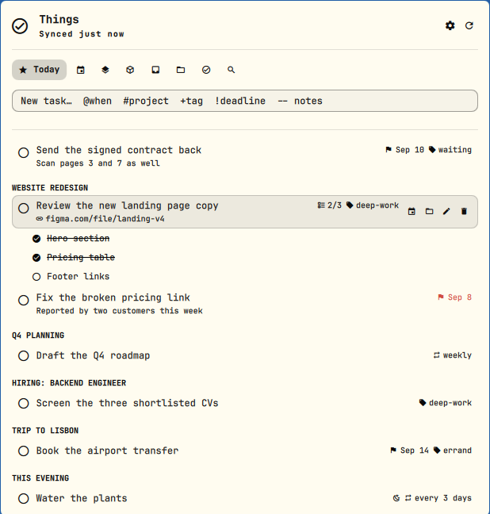
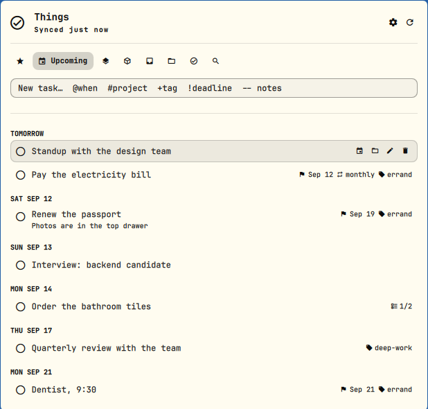
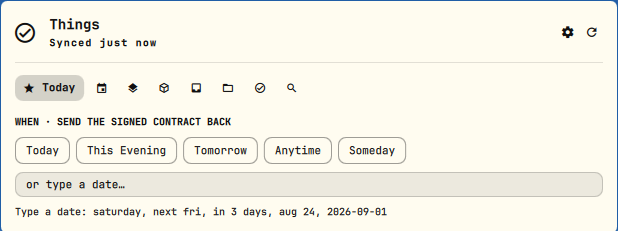
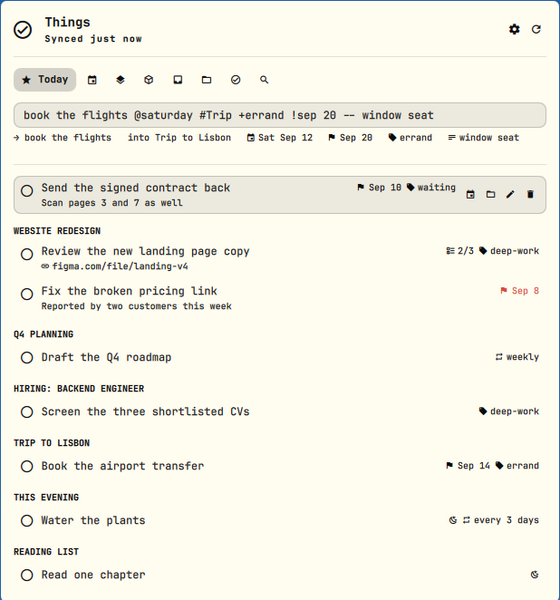
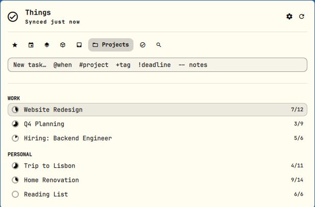
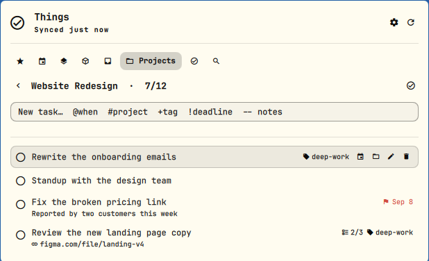
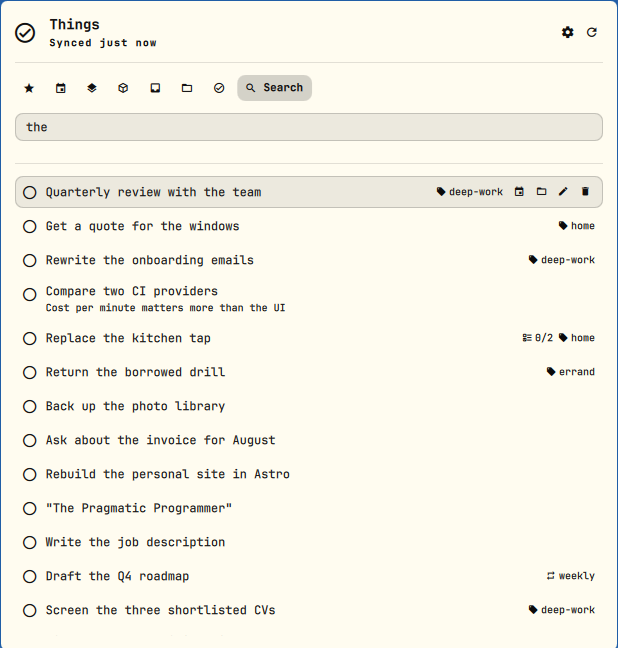
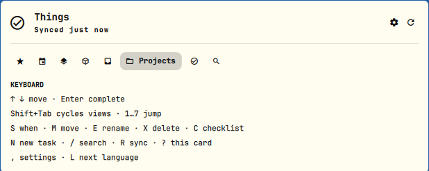
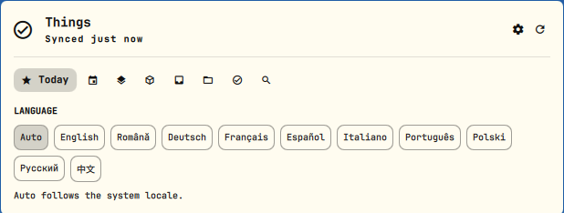
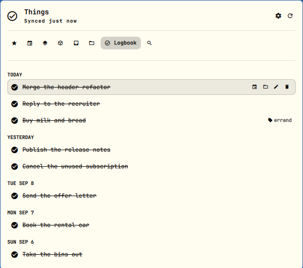

# Things — Omarchy bar widget

[Things 3](https://culturedcode.com/things/) in the Omarchy bar: the current
view's count at a glance, and a panel that holds all seven views of the app —
Today, Upcoming, Anytime, Someday, Inbox, Projects and Logbook — plus search
across everything. Synced through Things Cloud, so it is the same data as the
Mac and iPhone apps.




> Every screenshot on this page is sample data, in English.

The panel is built out of the shell's own panel primitives — the same hero,
section headings, cursor rows and edge action buttons as the built-in
Bluetooth and Network panels — so it looks like the rest of Omarchy rather
than like a port of the Things UI.

## Install

Things 3 itself only runs on Apple hardware, and this widget is not a
reimplementation of it. It is a front end for
[**`things3-cloud`**](https://github.com/evanpurkhiser/things3-cloud) — a
command-line client, written in Rust, that speaks the same Things Cloud sync
API the Mac and iPhone apps do. That CLI does the syncing, holds the local
cache and performs every write; the widget only asks it questions and draws
the answers. **Without it installed and signed in, the panel has nothing to
show and will say so.**

You also need Python 3, which Omarchy already has.

### 1. Install the `things3` CLI

It is on the AUR as `things3-cloud`:

```sh
omarchy pkg aur add things3-cloud
```

Any AUR helper does the same job — `yay -S things3-cloud`. Check it landed:

```sh
things3 --version      # things3 0.10.0 or newer
```

### 2. Sign in to Things Cloud, once

```sh
things3 set-auth
```

It prompts for the e-mail address and password of your **Things Cloud**
account — the same account Things on your Mac or iPhone syncs with. That
account is created inside the Things apps, so if you have never used Things on
an Apple device there is nothing on the server yet and nothing for the widget
to show. The credentials are written to `~/.local/state/things3/auth.json`,
readable only by you, and the CLI keeps its task cache next to it in
`~/.local/state/things3/`. Neither the widget nor its helper ever reads or
touches your password.

### 3. Check it before adding the widget

```sh
things3 today
```

If that prints your tasks, the widget will show them. If it prints an
authentication error, run `set-auth` again; if the command is not found, the
package is not installed.

### 4. Add the widget

```sh
omarchy plugin add https://github.com/MariusGhizdavet/omarchy-things --enable
```

`omarchy plugin add` clones the repo into
`~/.config/omarchy/plugins/mghizdavet.things/`; without `--enable` it stays
disabled so you can read the code first, and `omarchy plugin enable
mghizdavet.things` turns it on afterwards.

Then put it in the bar, if it is not there already:

```sh
omarchy bar move mghizdavet.things --section right
```

## Update

```sh
omarchy plugin update mghizdavet.things
omarchy-restart-shell
```

**Both lines.** `omarchy plugin update` fast-forwards the checkout and then calls
`rescanPlugins`, which does not re-instantiate QML that is already loaded — so
the update lands on disk, the command says `Updated`, and the panel keeps
running the old code until the shell restarts. That second line is the whole
difference between "it did not work" and "it works".

Note that `omarchy update` does **not** cover this: it updates system and AUR
packages, and never touches `~/.config/omarchy/plugins/`. Plugins are pulled by
hand, when you ask for them.

If you would rather not remember, `omarchy update` runs
`omarchy-hook post-update`, so a file at
`~/.config/omarchy/hooks/post-update.d/plugins` containing the two commands
above (with `--yes`) ties the two together. The trade-off is real: `--yes` skips
the diff of the incoming code, which for third-party plugins is the step worth
keeping.

## Remove

```sh
omarchy plugin remove mghizdavet.things
```

That deletes `~/.config/omarchy/plugins/mghizdavet.things/`. The widget keeps
no state of its own outside that directory — everything it shows lives in
Things Cloud and in the CLI's own cache — so nothing else is left behind.
To remove the CLI as well:

```sh
omarchy pkg drop things3-cloud
rm -rf ~/.local/state/things3      # cached tasks and your saved credentials
```

## Features

- **Seven views plus search.** The selected tab shows its name, the rest stay
  icons, so all eight fit on one row. Today groups by project with the evening
  tasks last; Upcoming groups by the day each task falls on; Anytime and
  Someday group by project; Projects groups by area and drills into a project;
  Logbook groups by the day you ticked things off.

  

- **Work the list.** Complete and un-complete, quick-add, reschedule, move
  between Inbox / projects / areas, rename inline, edit the notes, cancel, and
  delete with a confirmation. Checklists expand under their task and tick off
  individually; items can be added, renamed and removed from the row itself.

- **Canceled is not completed.** Things keeps the two apart — one says you did
  the thing, the other that you gave up on it — so the panel does too: a
  canceled task carries a crossed circle rather than a tick, and the row action
  cancels rather than completing. Enter on a canceled task brings it back.

  

- **Quick-add grammar.** One line carries the lot:
  `buy milk @saturday #groceries +errand !aug 24 -- and bread`. `@` sets when,
  `!` the deadline, `#` the project or area, `+` a tag, `--` the notes. A live
  preview under the field shows exactly what will be sent — already resolved,
  so `#groceries` reads back as the project's real name. Anything the parser
  did not recognise is called out instead of being silently swallowed.

  

- **Dates in words.** Both fields take `saturday`, `next fri`, `next week`,
  `in 3 days`, `aug 24`, `24 aug`, `12/25`, `25.12`, `2026-09-01` — **in all
  ten languages**, and independently of the language the panel is set to, so
  an English panel still understands `sâmbătă`, `nächste Woche`, `dans 3
  jours`, `za 3 dni`, `через 3 дня` or `3天后`. Diacritics are optional
  (`sâmbătă` and `sambata` both work) and German ordinals (`24. Dez`) are
  fine.
- **At a glance.** Each row can carry a deadline flag (red once it is past),
  an evening moon, its recurrence spelled out (`weekly`, `monthly`,
  `every 5 days`), the checklist progress, its tags, and one
  faint line of notes. A pasted link shows as its host and path and opens in
  your browser.
- **Projects with progress.** A Things-style pie per project, plus how many
  tasks are still open out of the total.

  

  

- **Search everything.** `/` searches across every view at once, completed
  tasks included.

  

- **Keyboard throughout.** See the `?` card in the panel.

  

- **Ten languages.** English, Romanian, German, French, Spanish, Italian,
  Brazilian Portuguese, Polish, Russian and Simplified Chinese, following the
  system locale by default. Counts use each language's own plural rules — so
  Romanian says `21 de deschise` and Polish `21 otwartych`, not a naive
  singular/plural pair — and dates follow each language's own order
  (`Sep 18`, `18 sep`, `18. Sep`, `9月18日`).

  

The Logbook keeps what you have already done, grouped by the day you ticked it
off:



## Recurrence

Recurring tasks are shown with their actual cadence, not just a repeat icon.
The CLI reports the rule only on the hidden template, so each instance is
matched back to its template and borrows it.

**Recurrence is read-only.** `things3` has no flag to create or change a
repeat on any of its commands, so the panel cannot make a task recurring —
set that up in Things on a Mac or iPhone and it shows here. Writing the raw
Things Cloud records to work around this would mean hand-rolling their sync
format against a live task database, which is not a risk worth taking for a
bar widget.

### Projected occurrences

A repeating task exists in Things as a hidden *template* plus the *instances*
materialised from it — and Things only materialises an instance around the day
it is due. The CLI never puts a template in a view, so until this was handled,
nothing recurring showed at all: the next Wednesday's task simply did not exist
yet as an object anyone could list.

The panel now computes those occurrences itself and shows them as **projected
rows**, with the cadence spelled out, sitting next to the real tasks: the one
falling today goes to Today, the rest to Upcoming under their own day. A past
occurrence that Things never materialised is not shown — it was never a real
task, so it does not belong among the overdue. The anchor is the last instance that was actually materialised,
not the rule's own start field, because a template can carry a start date of
the Unix epoch while its instances land on perfectly sensible days; only when a
template has produced nothing yet does the rule's anchor get used. Months and
years step from the anchor by index rather than from the previous occurrence,
so a "monthly, on the 31st" does not slide permanently onto the 28th after its
first February.

A projected row cannot be checked off, rescheduled, renamed or deleted: it has
no id the CLI would accept, so it carries no action buttons, its cursor stays
an arrow and its tooltip says why. It disappears on its own the day Things
materialises the real instance, which then takes its place. Projections are
also kept out of search and out of the project view, where six copies of the
same weekly task would be noise rather than information. The horizon is a year
and six occurrences per template; `bin/things-preia --projection-days 0` turns
them off.

The units are decoded from rules checked against the days their own
instances actually landed on: daily (`fu=16`), weekly (`fu=256`) and monthly
(`fu=8`). Yearly (`fu=4`) could not be checked the same way — a yearly task
has no second instance to measure the step against — but Things offers exactly
four units, the other three were pinned by the data, and the remaining one was
confirmed with the author of the task. Any `fu` outside the table is shown as
a plain "repeats" rather than guessed at.

## Keyboard

| Key | Does |
| --- | --- |
| `↑` `↓` / `k` `j` | move the cursor |
| `←` `→` / `h` `l` | move along a row's action buttons |
| `Enter` / `Space` | complete the task, tick the checklist item, open the project |
| `1`…`7` | jump to a view, in sidebar order |
| `Shift+Tab` | move to the next bar panel |
| `n` | new task (focus the quick-add field) |
| `/` | search everything |
| `s` | when… |
| `m` | move… |
| `e` | rename |
| `x` | delete |
| `c` | expand or collapse the checklist |
| `o` | open the link in the task's notes |
| `d` | show or hide completed tasks, inside a project |
| `r` | sync now |
| `g` / `Home` | back to the top |
| `,` | settings (language) |
| `L` | next language |
| `?` | the keyboard card |
| `Esc` | leave the field, close the sheet, leave the project, close the panel |

`j`, `k`, `h`, `l` and `x` are handled by the shell's shared key catcher, which
is why they are not available for anything else.

## Mouse

Left-click the pill opens the panel, middle-click cycles the view, right-click
syncs. In the list, left-click completes a task and right-click expands its
checklist; the four buttons on the right edge of a row are when, move, rename
and delete.

## Settings

**Language has its own picker in the panel** — the gear in the header, or the
`,` key; `L` steps to the next language without opening anything. The choice is
written to `shell.json` as the full name, so the file stays readable.

Everything else lives in `~/.config/omarchy/shell.json` and is set with
`omarchy bar set mghizdavet.things <key> <value>`:
the view the panel opens on, refresh
interval on mains and on
battery, how many days of Logbook to load, where quick-add puts a new task,
and whether to show the count, the notes line and the delete confirmation.

## How it works

The panel never talks to Things Cloud itself. `bin/things-preia` does one
sync and then reads every view from the CLI's local cache — `things3 --no-sync`
answers in about four milliseconds, against roughly seven hundred for a sync —
and writes a single JSON snapshot with the tasks, which view each belongs to,
the projects with their progress, the areas and the tags. View membership comes
from the CLI's own `today` / `upcoming` / … commands rather than being
recomputed here, because "Today" also means overdue, evening and recurring
instances, and a second implementation of that rule would drift.

That cost is why there are two refresh intervals in the settings — five
minutes on mains power, fifteen on battery by default, since a sync wakes the
radio. `r` in the panel, or a right-click on the bar pill, syncs immediately.

Writes go straight to `things3` with the arguments passed as a vector, never
through a shell, so a task title containing quotes, `$` or `;` is only ever
text. Completing and deleting are applied optimistically and reconciled by the
next snapshot, and every action is followed by a real sync — the write does one
of its own, but that one ends with it, so a change made on the phone meanwhile
would not arrive and a failed push would not be retried until the next tick.

The snapshot is read under hard byte ceilings. `bin/things-preia` streams each
`things3` run instead of buffering it whole: one run may write eight megabytes,
one snapshot thirty-two across all of its runs, and the JSON handed to the panel
sixteen — a real snapshot, with thousands of tasks, stays under one. Whatever
crosses a ceiling is killed mid-write and reported as an error rather than
parsed, and the panel holds its collector to the same rule, so a `things3` stuck
in a loop cannot grow the shell's memory without bound.

Dates need care in both directions. Things encodes a scheduled day as a
timestamp, in two different shapes — `--when today` gives midnight UTC, an
explicit date gives local midnight expressed in UTC — and the CLI builds the
second one with *today's* UTC offset, so a date on the far side of a daylight
saving change lands an hour off. Scheduling and deadline fields are therefore
read as the nearest local midnight, while genuine moments (created, modified,
completed) are read as plain local dates: a task ticked at 23:40 was ticked
that day, not the next one.

Writing goes the other way. Things itself stores a day as midnight UTC and its
own clients read the day back out of UTC, so an explicit date written as local
midnight is a day early for anyone east of Greenwich — a task put on tomorrow
showed up in Today on the iPhone. Any `things3` call that carries a real
`--when` or `--deadline` date is therefore run with `TZ=UTC`, which makes the
CLI write the same shape Things does. Only those: `today` and `evening` still
have to resolve in the local zone, or "today" would mean yesterday until 3 a.m.

## IPC

```sh
omarchy-shell things toggle
omarchy-shell things view upcoming
omarchy-shell things adauga "call the bank @tomorrow #Errands"
omarchy-shell things count
omarchy-shell things refresh
```

## License

MIT — see [LICENSE](LICENSE).
